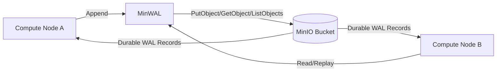
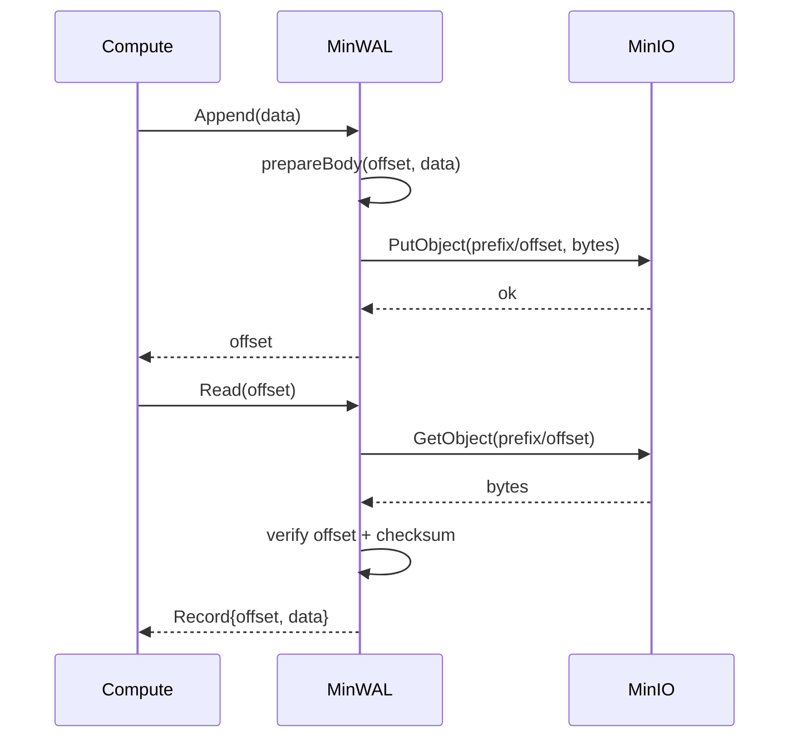

# wal_MinIO

A minimal write-ahead log (WAL) implementation that keeps compute and durable storage separated.

- Compute layer: your application processes and state machines.
- Storage layer: MinIO object storage persists WAL records.

This pattern supports disaggregated architectures where stateless or lightly stateful compute nodes share the same durable log.
We offload storage responsibilities to MinIO and focus this layer on WAL compute logic like sequencing, framing, validation, and replay.

## Why this project

Traditional WALs are local disk files tied to one host. This project stores each log record as a MinIO object so compute can scale independently from storage.

Benefits:
- Durable log in object storage
- Shared WAL across multiple compute nodes
- Simple recovery by reading records from MinIO

## Record format

Each WAL record is stored as:

- `8 bytes`: offset (big-endian uint64)
- `N bytes`: payload
- `32 bytes`: SHA-256 checksum over `offset + payload`

Object key format:
- `<prefix>/<20-digit-zero-padded-offset>`
- Example: `wal/00000000000000000042`

## Architecture



## Write and read flow



## API

Interface in `wal.go`:

- `Append(ctx, data) (offset, error)`
- `AppendExpected(ctx, expectedOffset, data) (offset, error)`
- `Read(ctx, offset) (Record, error)`
- `LastRecord(ctx) (Record, error)`

`AppendExpected` behavior:
- Writes only to the exact `expectedOffset` key using a create-if-absent condition.
- If that key already exists and has the same payload, it returns success (idempotent retry).
- If that key exists with different payload, it returns an error.

Implementation in `wal_min.go`:
- `NewWAL(client, bucket, prefix) *MinWAL`

## Quick start

### 1. Install deps

```bash
go mod tidy
```

### 2. Create MinIO client and WAL

```go
package main

import (
    "context"
    "log"

    "github.com/minio/minio-go/v7"
    "github.com/minio/minio-go/v7/pkg/credentials"

    walminio "github.com/atharvamhaske/s3-db"
)

func main() {
    ctx := context.Background()

    client, err := minio.New("localhost:9000", &minio.Options{
        Creds:  credentials.NewStaticV4("minioadmin", "minioadmin", ""),
        Secure: false,
    })
    if err != nil {
        log.Fatal(err)
    }

    wal := walminio.NewWAL(client, "wal-bucket", "wal")

    off, err := wal.Append(ctx, []byte("event-1"))
    if err != nil {
        log.Fatal(err)
    }

    rec, err := wal.Read(ctx, off)
    if err != nil {
        log.Fatal(err)
    }

    log.Printf("offset=%d data=%s", rec.Offset, string(rec.Data))
}
```

## Testing

Run unit tests:

```bash
go test ./...
```

Current test file:
- `wal_min_test.go`

Coverage focus:
- key formatting and offset parsing
- checksum generation and validation
- record body layout
- tamper detection

## Current limitations

- No batching or fsync-like grouping semantics
- No compaction or retention policy
- `LastRecord` scans object keys under prefix
- No optimistic concurrency control beyond object existence match

## Next extension ideas

- Add idempotent append with expected offset
- Add segment index objects for faster tail lookup
- Add retention and archival policies
- Add integration tests with live MinIO container
